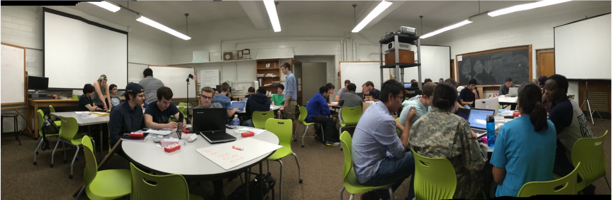

::: {.hero-section}

## What We Do

We are an education research group in the **Department of Physics at Penn State University**. Our long-term objective is to help students become better self-directed learners while they experience an education system that is fun, rewarding, inclusive, and equitable.

:::

## Collaborative Projects

::: {.card-grid}

::: {.card}
### Alternative Grading

We are developing and studying alternative grading systems to create more equitable assessment practices.

[Learn more](https://sites.psu.edu/grade){.btn .btn-primary}
:::

::: {.card}
### The Nudge / StSRL Project

*Success through Self-Regulated Learning* -- an NSF Level 2 IUSE project (Award #2337176) studying how digital prompts can support students' self-regulated learning.

[Learn more](https://sites.psu.edu/stsrl/){.btn .btn-primary}
:::

:::

## Research Focus

Our research centers on **innovative learning tools in online education**, particularly science laboratories in asynchronous introductory physics courses delivered through Penn State World Campus. Our courses target non-traditional adult learners.

### Key Questions

- What course components are most effective for online learners?
- How effective are online labs conducted in home settings?
- What strategies optimize student engagement in asynchronous courses?
- How do self-regulatory learning, critical thinking, and communication skills develop in online settings?

